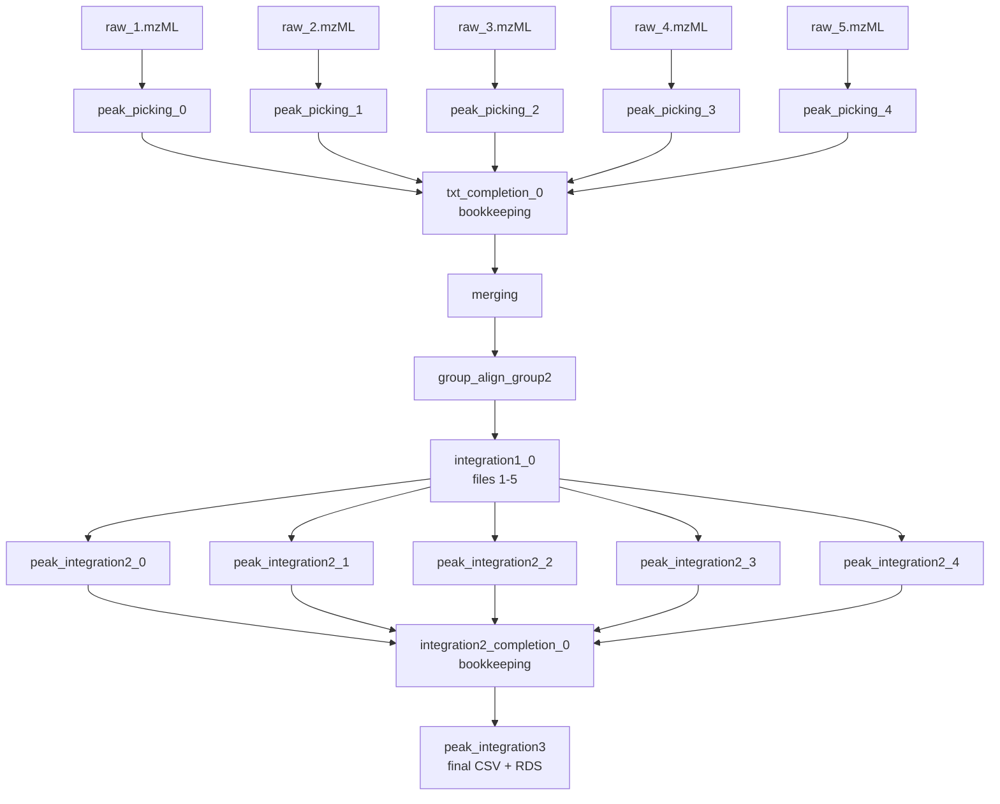

# xcms workflow

GWF workflow that takes raw mzML files through XCMS peak picking, merging,
alignment, and three rounds of peak integration to produce a feature table.

## Pipeline stages

| # | Stage | Script | Granularity |
|---|---|---|---|
| 1 | Peak picking | `step1_peakcalling.R` | one job per raw file |
| 2 | Bookkeeping | (inline) | one job per 1000 files |
| 3 | Merging | `step2_merging.R` | single job |
| 4 | Group / Align / Group2 | `step2_merge_group_align.R` | single job |
| 5 | Integration 1 | `step6_integration1.R` | one job per 100 files |
| 6 | Integration 2 | `step7_integration2.R` | one job per file |
| 7 | Integration 2 bookkeeping | (inline) | one job per 1000 files |
| 8 | Integration 3 | `step8_integration3.R` | single job (final output) |

## DAG on 5 input files

With 5 raw files, the per-file fan-outs each collapse into a single job
(since 5 < both the 100-file and 1000-file bucket sizes). Per-file steps
(1 and 6) produce 5 parallel jobs; everything else is one job.

## Scaling notes

- **Step 1 (peak picking)** scales linearly with the number of files.
- **Step 5 (integration 1)** issues one job per 100-file window — e.g. 1500
  files produce 15 jobs.
- **Steps 2 and 7 (bookkeeping)** issue one job per 1000-file window; they
  exist purely as DAG fan-in points so the next stage has a small fixed set
  of dependencies instead of thousands.
- **Steps 3, 4, and 8** are single high-memory jobs (up to 600 GB) and are
  the typical bottleneck.
